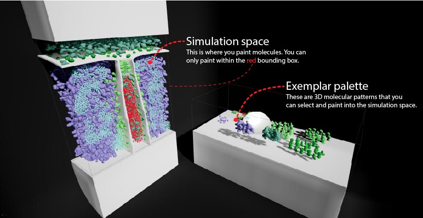

# LifeBrush
LifeBrush is a VR Unreal Engine 4 toolkit for creating interactive biomolecular illustrative simulations. Users paint molecules into a simulation (TileBrush style) in VR. A fast and powerful agent-based modeling framework drives those simulations, the framework is fully integrate into the Unreal Editor.

LifeBrush is fast. The generative brushes can synthesize thousands of molecules per second in volumes and on surfaces. The agent-based modeling framework is also fast, capable of simulating more than 10,000 agents at 90 fps in VR.

The C++ agent framework is based on an Entity-Component-System that we developed for Unreal Engine. Components are compact C++ structs. Entities organize multiple components into a single entity. We do not use Unreal's actor-component model because it cannot handle very large numbers of agents. Our ECS is the basis of our brush-based synthesis framework for painting agents and for simulating them.

This toolkit was orignally described in a conference paper in 2018, "LifeBrush: Painting interactive agent-based simulations" by Timothy Davison, Faramarz Samavati and Christian Jacob (the bibtex is below). The version here on GitHub is a significant evolution of that paper.

# Build instructions

Clone the repository and open the LifeBrush.uproject with Unreal Engine 4.18.

Requirements:
- Unreal Engine 4.18
- Windows 10
- At least an Nvidia GTX 1080
- HTC Vive

I haven't tested with an Oculus Rift, I'm pretty sure it won't work out of the box.

# Using LifeBrush

LifeBrush is designed to run within the Unreal Editor and not as a standalone program. Within the Unreal Editor you use the VR preview mode to enter the painting environment.



The VR painting environment (above) contains a simulation space where you can paint molecules with a 3D generative brush using the Vive wand. You pull the trigger to control the size of the pattern painted into the scene. You can only paint within the bounds of the simulation space&mdash;the size of which is configurable back in the Unreal Editor.  

The patterns that you can paint are selected from an exemplar palette. The patterns capture the spatial arrangement of molecules and the properties and configuration of the agents that simulate those molecules. The generative brush doesn't just tile these patterns, it generates new non-repetitve arrangments in the simulation space that are similar to the selection the exemplar palette.

New patterns can be created in the exemplar palette within the Unreal Editor. There is also an old broken editor within VR that allows you to create patterns in VR, but I will probably remove this in the future.


Pressing the shoulder button (the button above the trackpad) summons the VR menu where one can select different tools and switch back and forth between the simulation mode and the painting mode. There is a pointer cylinder that is visible when one hovers the controller over the menu. Pulling the trigger activates the menu item being pointed at. Don't point the controller at the menu, it should be a little tilted. This is akward, this is on my to-do list.


There are two modes, a painting mode and simulation mode. Choose Enter Simulation to enter the simulation mode, this will change the menu options. You can go back to the painting mode with Enter Painting.

The generative brush lets you paint agents. You have to select some agents from the exemplar first. You select by putting the tip of the controller over the molecule you want to select, then squeeze the trigger to select it. You can select multiple molecules by holding the trigger down and moving the controller around. How hard you squeeze the controller controls the size of the selection sphere. You cannot select two different groups of molecules at the same time, nothing will be painted. This limitation is on the to-do list.

With some molecules selected you can paint within the simulation box by squeezing the trigger. The molecules are created at the tip of the controller. The controller must be within the simulation box, or nothing will be generated. The simulation box is there to limit the number of agents simulated, the soft limit is about 10,000 on my computer for 90fps playback.

There are two demo levels, a bare mitochondrion ``mitochondrion_blank`` and one where the molecules have already been painted into a mitochondrial scene, ``mitochondrion_completed``.

You can press the top-half or the bottom-half of the trackpad to toggle the options of the current tool. For the generative brush, you can press the top-half of the trackpad to switch between painting on surfaces or painting directly into space. The bottom half toggles between generating molecules and an eraser mode.

# License and Copyright

All code, unless stated otherwise, is Copyright (c) 2019, Timothy Davison. All rights reserved.

All of my code is released under a MIT license. There are included source-codes released under their respective licenses.

**Please cite with:**
```
@inproceedings{davison2018lifebrush,
  title={LifeBrush: Painting interactive agent-based simulations},
  author={Davison, Timothy and Samavati, Faramarz and Jacob, Christian},
  booktitle={2018 International Conference on Cyberworlds (CW)},
  pages={17--24},
  year={2018},
  organization={IEEE}
}
```
